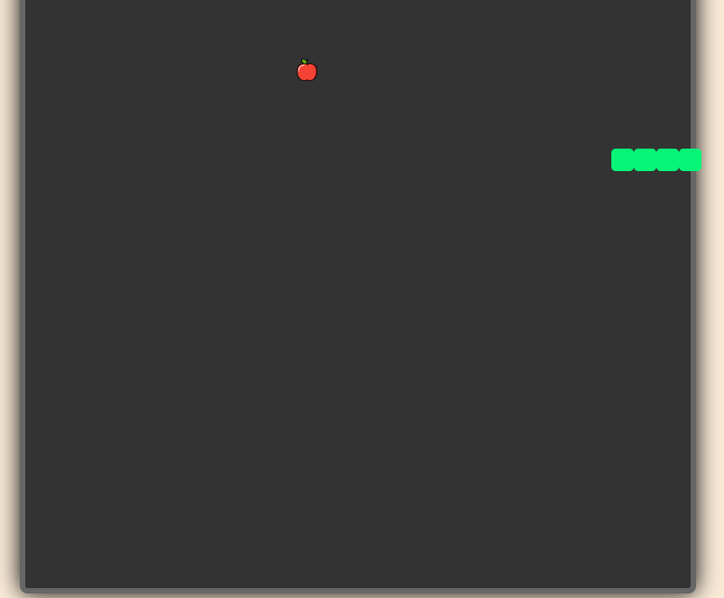

# 🐍 Snake Game

Welcome to **Snake Game**! A classic game of skill and reflex, now in a simple web-based format. Move the snake to eat food, grow longer, and see how high you can score. Try to avoid hitting the walls or yourself!

## 📋 Project Overview

This project implements a responsive and interactive snake game using HTML, CSS, and JavaScript. The game dynamically renders the snake's movements and increases in difficulty as the snake grows.

## 📸 Screenshots



## 🚀 Features

- **Food Consumption**: Each time the snake eats food, it grows longer and scores increase.
- **Dynamic Difficulty**: The snake moves faster as it grows, increasing the game's challenge.
- **Start Button**: Players can start the game whenever they're ready.
- **Scoreboard**: Track your current score displayed on the screen.

## 🕹️ Controls

Use the following keyboard keys to control the snake:

- **Arrow Keys**:
  - **Up Arrow** 🡑: Move Up
  - **Down Arrow** 🡓: Move Down
  - **Left Arrow** 🡐: Move Left
  - **Right Arrow** 🡒: Move Right

## 📁 Project Structure

```plaintext
├── index.html    # HTML structure of the game
├── style.css     # Styling for the game elements
└── index.js      # Game logic and interactive elements
```

## 🧩 Code Snippets

Here’s a quick look at the JavaScript logic that controls the snake’s movement and collision detection:

```javascript
function updateSnake() {
  const newHead = { x: snake[0].x + dX, y: snake[0].y + dY };
  snake.unshift(newHead); // Add new head
  if (newHead.x == food.x && newHead.y == food.y) {
    score += 5;
    moveFood();
  } else {
    snake.pop(); // Remove last tail
  }
}
```

## 🛠️ Setup and Installation

1. Clone the repository to your local machine:
   ```bash
   git clone https://github.com/iamrajanjharj/snake-game.git
   ```
2. Navigate into the project directory:
   ```bash
   cd snake-game
   ```
3. Open `index.html` in your browser to start the game.

## 📄 How to Play

1. Open `index.html` in a browser.
2. Click the **Start** button to begin.
3. Use the arrow keys to guide the snake to the food.
4. Avoid hitting the walls or the snake itself!

## 🏆 Objective

Score as high as you can by collecting food, growing longer, and avoiding collisions.

---

Enjoy playing the **Snake Game**! 🐍🎮

---
